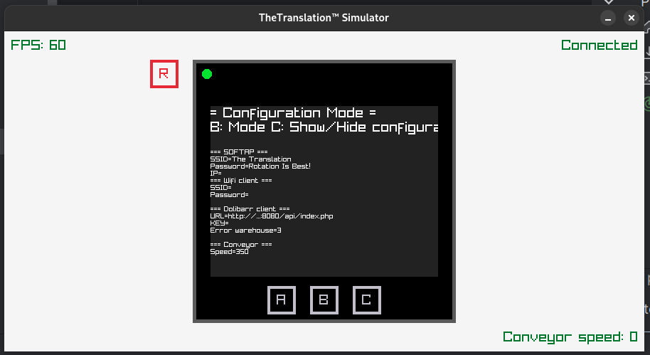

# The Translation - Simulation Client

This is a graphical user interface (GUI) for the Translation simulation.  
It is build using Raylib, C++ 11 and CMake with no other dependencies.  
This program communicates with the Translation simulation server using an Unix socket.



## Dependencies

- Raylib
- C++11 compiler (GCC or Clang)
- CMake
- Ninja (optional)

## Build

Debug build:
```shell
cmake -DCMAKE_BUILD_TYPE=Debug -G Ninja -S . -B cmake-build-debug
cmake --build cmake-build-debug --target simulation-client -j$(nproc)
```

## Running

```shell
# Debug
./cmake-build-debug/src/simulation-client
# Release 
./cmake-build-release/src/simulation-client
```